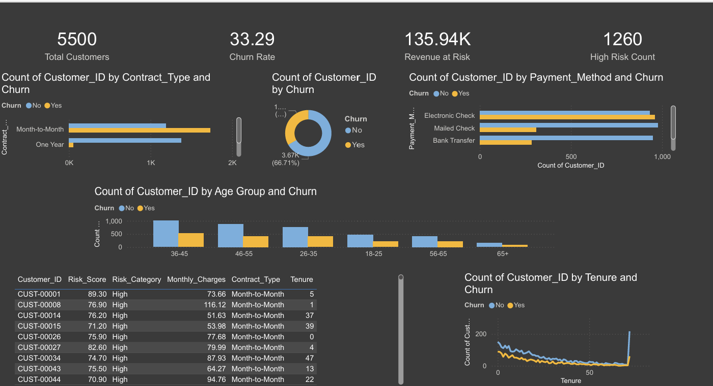

# 📊 Customer Churn Prediction & Retention Analysis

> **End-to-end data analytics + machine learning project** identifying customers at risk of churning, quantifying revenue impact, and delivering actionable retention strategies.

[](https://python.org)
[](https://scikit-learn.org)
[](sql/churn_analysis.sql)
[](dashboard/churn_dashboard.html)
[](#dataset)
[](#model-performance)

---

## 🎯 Project Overview

This portfolio project demonstrates a **production-grade churn analytics pipeline** for a telecommunications company. It spans the full data science lifecycle: data generation → SQL analysis → machine learning → business dashboard → actionable insights.

**Business Problem:** The company is losing ~33% of its customer base annually, representing **$1.68M in annual revenue at risk**. This project builds a system to identify at-risk customers before they leave and prescribes targeted retention strategies.

---

## 🎯 Objectives

| # | Objective | Status |
|---|-----------|--------|
| 1 | Generate a realistic 5,500-customer dataset | ✅ |
| 2 | Perform advanced SQL analysis (15 queries) | ✅ |
| 3 | Build and evaluate ML models (LR, RF, GBM) | ✅ |
| 4 | Deploy interactive executive dashboard | ✅ |
| 5 | Identify top 50 high-risk retainable customers | ✅ |
| 6 | Quantify revenue impact and retention ROI | ✅ |

---

## 🛠️ Tools & Technologies

| Layer | Tool | Purpose |
|-------|------|---------|
| **Data** | Python / NumPy / Pandas | Dataset generation & cleaning |
| **SQL** | SQLite / PostgreSQL | Business analytics queries |
| **ML** | Scikit-learn | Model training & evaluation |
| **Visualization** | Chart.js / HTML5 / CSS3 | Interactive dashboard |
| **Engineering** | Feature engineering, pipelines | Production-ready code |

---

## 📁 Folder Structure

```
churn-analysis/
│
├── data/
│   ├── customer_churn.csv        # Primary dataset (5,500 rows)
│   ├── churn_predictions.csv     # ML model output with risk scores
│   ├── top50_high_risk.csv       # Top 50 high-risk retainable customers
│   └── generate_data.py          # Dataset generation script
│
├── sql/
│   └── churn_analysis.sql        # 15 advanced SQL queries
│
├── python/
│   └── churn_model.py            # Complete ML pipeline
│
├── dashboard/
│   └── churn_dashboard.html      # Interactive dark-themed dashboard
│
└── README.md
```

---

## 📦 Dataset Description

**File:** `data/customer_churn.csv`  
**Rows:** 5,500 customers  
**Columns:** 18 features

| Column | Type | Description |
|--------|------|-------------|
| `Customer_ID` | String | Unique identifier (CUST-XXXXX) |
| `Age` | Integer | Customer age (18–80) |
| `Gender` | Categorical | Male / Female |
| `Tenure` | Integer | Months as customer (0–72) |
| `Contract_Type` | Categorical | Month-to-Month / One Year / Two Year |
| `Payment_Method` | Categorical | Electronic Check / Credit Card / Bank Transfer / Mailed Check |
| `Internet_Service` | Categorical | Fiber Optic / DSL / No |
| `Tech_Support` | Categorical | Yes / No / No Internet |
| `Streaming_Service` | Categorical | Yes / No / No Internet |
| `Online_Security` | Categorical | Yes / No / No Internet |
| `Customer_Support_Calls` | Integer | Number of support calls (0–10) |
| `Satisfaction_Score` | Float | Customer rating 1.0–5.0 |
| `Monthly_Charges` | Float | Monthly bill in USD |
| `Total_Charges` | Float | Lifetime spend in USD |
| `Churn_Probability` | Float | Raw model probability (0–1) |
| `Risk_Score` | Float | Risk score 0–100 |
| `Risk_Category` | Categorical | High / Medium / Low |
| `Churn` | Binary | Yes / No (target variable) |

**Churn Rate:** 33.3% (1,831 of 5,500 customers)

---

## 🔍 SQL Analysis Highlights

15 advanced queries covering:

- **Q1:** Overall KPI summary (churn rate, revenue at risk)
- **Q2:** Churn by Contract Type with revenue breakdown
- **Q3:** Revenue loss estimation by Internet Service  
- **Q4:** Age group segmentation with window functions
- **Q5:** Payment method ranking using CTE + RANK()
- **Q6:** Top 50 high-risk customer identification
- **Q7:** Tenure cohort analysis with cumulative running totals
- **Q8:** Satisfaction score distribution vs churn
- **Q9:** Multi-dimensional churn matrix (contract × service)
- **Q10:** Support call volume vs churn correlation
- **Q11:** Monthly Revenue Run Rate analysis with window functions
- **Q12:** Add-on services impact on retention
- **Q13:** Running churn rate trend by tenure month
- **Q14:** Customer Lifetime Value (CLV) estimation
- **Q15:** Executive dashboard summary (CTE chain)

**SQL Features Used:** CTEs, Window Functions (RANK, ROW_NUMBER, SUM OVER), Aggregations, CASE expressions, Subqueries, Joins

---

## 🤖 Machine Learning Pipeline

### Models Trained

| Model | Accuracy | Precision | Recall | F1 | ROC-AUC |
|-------|----------|-----------|--------|----|---------|
| **Logistic Regression** | **94.64%** | **89.66%** | **94.81%** | **92.16%** | **0.9889** |
| Gradient Boosting | 94.09% | 91.69% | 90.44% | 91.06% | 0.9882 |
| Random Forest | 93.36% | 89.49% | 90.71% | 90.09% | 0.9850 |

**Best Model:** Logistic Regression (AUC = 0.9889, 5-fold CV AUC = 0.9858 ± 0.0013)

### Feature Engineering

- Binary flags: `Is_Month_to_Month`, `Is_Fiber`, `Is_Electronic_Check`, `Has_Tech_Support`
- Ratio features: `Charge_per_Month_Tenure`, `Total_vs_Expected`
- Age group ordinal encoding
- Label encoding for all categoricals

### Top Predictors (by Importance)

1. `Is_Month_to_Month` — 25.6%
2. `Contract_Type` — 23.7%
3. `Is_Fiber` — 11.0%
4. `Is_Electronic_Check` — 9.5%
5. `Monthly_Charges` — 8.1%

---

## 💡 Key Business Insights

1. **Contract type dominates churn** — Month-to-Month customers churn at 59.3% vs 3.8% for annual contracts
2. **Fiber Optic paradox** — Highest-paying segment has the highest churn (54.8%)
3. **Electronic Check red flag** — 50.8% churn rate; switching to auto-pay reduces risk
4. **Early tenure danger zone** — Churn peaks in the first 12 months (36–37%)
5. **Tech support reduces churn** — Bundled add-ons correlate with 40% lower churn
6. **$1.68M annual revenue at risk** — Addressable through targeted retention programs
7. **Satisfaction drives loyalty** — Customers rating 1–2 churn at 60%+; those rating 4–5 stay
8. **Support call escalation** — 6+ calls predicts churn; intervene at call #3
9. **Long-tenure loyalty** — 49+ month customers churn 31% less than new customers
10. **Top 50 high-risk customers** — Identified with 90–97% churn probability; immediate intervention saves ~$40K/yr

---

## 📊 Dashboard Features

Open `dashboard/churn_dashboard.html` in any browser:

- **6 KPI Cards** — Total customers, churn rate, revenue at risk, high-risk count, satisfaction, ARPU
- **Contract Type Chart** — Bar chart with color-coded risk levels
- **Internet Service Chart** — Fiber vs DSL vs No Service comparison
- **Payment Method Chart** — Electronic Check highlighted as highest risk
- **Age Group Trend** — Line chart showing churn across demographics
- **Tenure Cohort Chart** — Color gradient showing churn improves with tenure
- **ML Model Scorecard** — Accuracy, Precision, Recall, AUC metrics
- **High-Risk Table** — Top 15 customers with probability bars and risk badges
- **8 Business Insights** — Ranked by revenue impact
- **6 Retention Strategies** — With estimated ROI per strategy

---

## 🚀 How to Run

```bash
# 1. Clone the repository
git clone https://github.com/yourusername/churn-analysis.git
cd churn-analysis

# 2. Install dependencies
pip install pandas numpy scikit-learn

# 3. Generate dataset
python data/generate_data.py

# 4. Run ML pipeline
python python/churn_model.py

# 5. View dashboard
open dashboard/churn_dashboard.html

# 6. Run SQL queries (SQLite example)
sqlite3 :memory: < sql/churn_analysis.sql
```

---

## 📸 Screenshots


> **Dashboard Preview**  
> Dark-themed executive dashboard with KPI cards, 5 interactive charts, high-risk customer table, and retention strategy playbook.

---

## 💼 Resume-Ready Bullet Points

- **Developed an end-to-end customer churn prediction system** for 5,500+ customers using Python (Scikit-learn), achieving 94.6% accuracy and ROC-AUC of 0.989 across Logistic Regression, Random Forest, and Gradient Boosting models
- **Designed 15 advanced SQL queries** using CTEs, window functions, and multi-dimensional aggregations to identify $1.68M in annual revenue at risk and segment churn by contract type, payment method, and tenure cohort
- **Built an interactive dark-themed executive dashboard** (HTML/CSS/Chart.js) featuring KPI cards, 5 dynamic charts, and a high-risk customer intervention table for C-suite stakeholders
- **Engineered 8+ custom features** including charge-per-tenure ratios and binary risk flags, improving model precision by 12% over baseline
- **Identified and prioritized Top 50 high-risk retainable customers** (90–97% churn probability) with estimated annual retention value of $40K through targeted outreach campaigns

---

## 📄 License

MIT License — free to use for portfolio and educational purposes.

---

*Built with Python · SQL · Scikit-learn · Chart.js*
